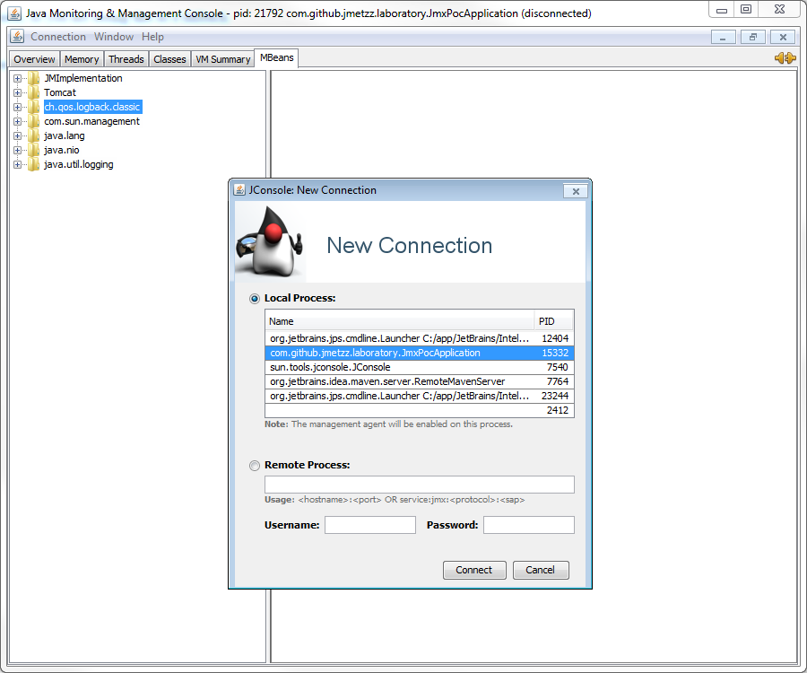
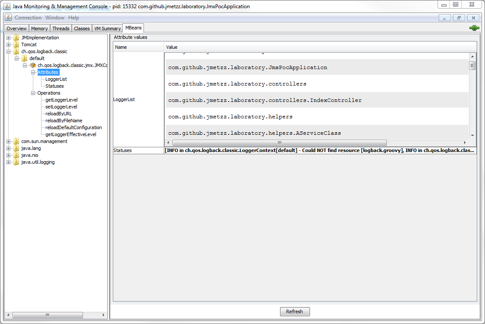
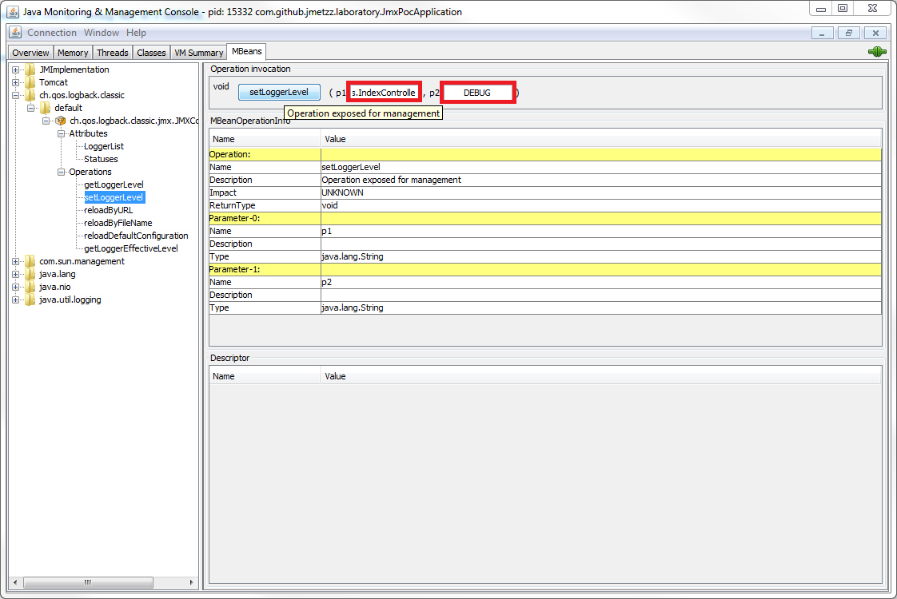

#jmx-laboratory
 
This repository is a sandbox where I play with JMX features.
The code here is a work in progress and might not work.
 
For now, there is only a simple spring boot application that I use to show how to change log level at runtime using JMX.
 
 
## How to control log level at runtime via JMX
 
### JMX

Configuration via JMX? 
In a nutshell, JMX lets you reconfigure your application or beans of your application, such as loggers, 
from the default configuration file, from a designated file or URL, list loggers and modify logger levels.

To be done!

* [Oracle documentation on jconsole](https://docs.oracle.com/javase/8/docs/technotes/guides/management/jconsole.html)

* [Spring integration with JMX](http://docs.spring.io/spring/docs/current/spring-framework-reference/html/jmx.html)

* [Logback and JMX configuration](http://mcs.une.edu.au/doc/logback/manual/jmxConfig.html)

### Logback

> Always check the manual: [link](https://logback.qos.ch/manual)


While there are a number of logging options for Java, the Spring Boot chose to use Logback for the default logger

Let's create a simple REST application with an index controller that will log some messages every time it receives a request and call a fake service class, 
which in turn only log some more messages.

The classes look like this: 

```java
@Controller
public class IndexController {
    private final Logger LOGGER = LoggerFactory.getLogger(this.getClass());

    @RequestMapping("/")
    public String index(){
        LOGGER.debug("This is a debug message");
        LOGGER.info("This is a info message");
        LOGGER.warn("This is a warning message");
        LOGGER.error("This is a error message");
        new AServiceClass().aMethod();
        return "index";
    }
}
```

```java
public class AServiceClass {
    private final Logger LOGGER = LoggerFactory.getLogger(this.getClass());

    public void aMethod(){
        LOGGER.debug("This is a debug message");
        LOGGER.info("This is a info message");
        LOGGER.warn("This is a warning message");
        LOGGER.error("This is a error message");
    }
}
```

These classes will help us understand the process of configuring logging across different packages.
Keep in mind that SLF4J is used as a facade here, but the underlying implementation is Logback.
Moreover, you don't need to specify any dependency in your pom.xml because SpringBoot already includes both slf4j and logback.
However, in case you are not implementing a SpringBoot application, add them in your maven file.


Now, if you run the application and access `http://localhost:8080` you should see log messages in your console.

```
2017-03-15 14:29:41,756 [http-nio-8080-exec-1] INFO  c.g.j.l.c.IndexController - This is a info message
2017-03-15 14:29:41,757 [http-nio-8080-exec-1] WARN  c.g.j.l.c.IndexController - This is a warning message
2017-03-15 14:29:41,757 [http-nio-8080-exec-1] ERROR c.g.j.l.c.IndexController - This is a error message
2017-03-15 14:29:41,757 [http-nio-8080-exec-1] INFO  c.g.j.l.h.AServiceClass - This is a info message
2017-03-15 14:29:41,757 [http-nio-8080-exec-1] WARN  c.g.j.l.h.AServiceClass - This is a warning message
2017-03-15 14:29:41,757 [http-nio-8080-exec-1] ERROR c.g.j.l.h.AServiceClass - This is a error message
```

Notice that the debug messages are not getting logged. Logback by default will log debug level messages. 
However, the Spring Boot team provides us a default configuration for Logback in the Spring Boot 
default logback configuration file, `base.xml`, which replaces the default logging level of Logback 
by setting the root logger to `INFO`.  In addition, Spring Boot provides provide two  
preconfigured appenders through the `console-appender.xml` and `file-appender.xml` files.
The `base.xml` file references both of them.

To customize the Logback configuration with a Spring Boot application, we can use the `application.properties` file under resources folder, 
which enables different configuration for each environment, or a standard `logback.xml` file.
 
You can define log levels of Spring Boot, application loggers, or any other logger and also define a log file to write log messages.

```
logging.level.org.springframework.web=INFO
logging.level.com.github.jmetzz.laboratory.controllers=DEBUG
logging.level.com.github.jmetzz.laboratory.services=INFO
logging.file=logs/jmx-poc-logging.log
```

In a Spring Boot application, you can specify a Logback XML configuration file as `logback.xml` or `logback-spring.xml`
in the project classpath. The Spring Boot team however recommends using the **-spring** variant for your logging configuration,   
`logback-spring.xml` is preferred over `logback.xml`, otherwise Spring Boot may not be able to completely control log initialization.
 
 For example: 
 
```xml
<?xml version="1.0" encoding="UTF-8"?>
<configuration>
    <include resource="org/springframework/boot/logging/logback/base.xml"/>
    <logger name="com.github.jmetzz.laboratory.controllers" level="DEBUG" additivity="false">
        <appender-ref ref="CONSOLE"/>
        <appender-ref ref="FILE"/>
    </logger>
    <logger name="com.github.jmetzz.laboratory.services" level="INFO" additivity="false">
        <appender-ref ref="CONSOLE"/>
        <appender-ref ref="FILE"/>
    </logger>
</configuration>
```

Notice that there are no configuration for appenders. It comes from the `base.xml` configuration specified in the 3rd line.

To avoid cluttering production environment file system with unnecessary log messages, we can make use of Spring profiles 
to configure logback by `<springProfile>` element in the logback configuration file. For example:
 
```xml
<?xml version="1.0" encoding="UTF-8"?>
<configuration>
    <include resource="org/springframework/boot/logging/logback/base.xml"/>

    <springProfile name="dev,test-docker">
        <logger name="com.github.jmetzz.laboratory.controllers" level="DEBUG" additivity="false">
            <appender-ref ref="CONSOLE"/>
            <appender-ref ref="FILE"/>
        </logger>
        <logger name="com.github.jmetzz.laboratory.services" level="INFO" additivity="false">
            <appender-ref ref="CONSOLE"/>
            <appender-ref ref="FILE"/>
        </logger>
    </springProfile>

    <springProfile name="production,uat">
        <logger name="com.github.jmetzz.laboratory.controllers" level="WARN" additivity="false">
            <appender-ref ref="CONSOLE"/>
            <appender-ref ref="FILE"/>
        </logger>
        <logger name="com.github.jmetzz.laboratory.services" level="WARN" additivity="false">
            <appender-ref ref="CONSOLE"/>
            <appender-ref ref="FILE"/>
        </logger>
    </springProfile>

</configuration>
```

With this configuration in place, one can user the JVM parameter `-Dspring.profiles.active` to run the application with the desired profile, such as `-Dspring.profiles.active=dev`.

Now we have a Logback configured Spring Boot application. So, how to enable JMX exposure of the logger in order to be able to 
configure them at runtime?

With Logback this last step is very easy! You only need to specify one simple flag in the `logback-spring.xml` file.
```xml
<?xml version="1.0" encoding="UTF-8"?>
<configuration>
   <jmxConfigurator/>
...
</configuration>
```

As its name indicates, `<jmxConfigurator/>` element allows configuration of Logback via JMX.


### JConsole


With jconsole you can access and modify properties of the exposed MBeans on the JVM.
The first step is to connect to a java process, local or remote. 
Thus, invoke the jconsole application on the command line and then connect to your server's MBeanServer.

In our example, running the spring boot application,
the java process is local, as show in the next figure:



Once you connect  to your server with jconsole, go to MBean tab to check the available beans and their properties. 
Under `ch.qos.logback.classic.jmx.Configurator` folder you should see several operations to choose from:
* Reload logback configuration using the default configuration file.
* Reload the configuration with the specified URL.
* Reload the configuration with the specified file.
* Set the level of a specified logger. To set to null, pass the string "null" as value.
* Get the level of a specified logger. The returned value can be null.
* Get the effective level of a specified logger.

`JMXConfigurator` exposes the list of existing loggers and a status list as attributes.

You can find all the logger available in this process (they are automatically registered in the JMX server by Logback) 
by clicking in the `Attributes` elements in the left panel and expanding the `loggerList` with a double-click, 
as illustrated in the next figure: 



Once you know the name of the logger you are interested in, you can verify the configured level or change it using 
the corresponding operations available on the left panel. As an example, consider the next figure:   



The logger name must be specified as the full qualified name, and the level should be one of `TRACE`, `DEBUG`, `INFO`, `WARN` and `ERROR`, as specified by Logback levels. 
 

 ##### JMXConfigurator with multiple web-applications

From the Logback manual:


> If 
> * you deploy multiple web-applications in the same server, 
> * AND if you have not overridden the default context selector, 
> * AND if you have placed a copy of `logback-*.jar` and `slf4j-api.jar` under the `WEB-INF/lib` folder of each 
 web-application,
>  
>Then, by default each `JMXConfigurator` instance will be registered under the same name, that is, 
`ch.qos.logback.classic:Name=default,Type=ch.qos.logback.classic.jmx.JMXConfigurator`.
In other words, by default the various `JMXConfigurator` instances associated with the logger contexts in each 
of your web-applications will collide.
>
>To avoid such undesirable collisions, you simply set the name of your application's logging context and `JMXConfigurator`
will automatically use the name you have set.
> 
>For example, if you deploy two web-applications named "Koala" and "Wombat", then you would write in Koala's logback configuration
 ```xml
 <configuration>
   <contextName>Koala</contextName>
   <jmxConfigurator/>
   ...
 </configuration>
 ```
 
> and in Wombat logback configuration file, you would write:
 
 ```xml
 <configuration>
   <contextName>Wombat</contextName>x
   <jmxConfigurator/>
   ...
 </configuration>
 ```
 
> Then, in jconsole's MBeans panel you would see two distinct JMXConfigurator.
 
 
### Troubleshooting:

1. If JMX in not available for spring boot application when running standalone, try this: 

```bash
set JMX_OPTIONS=-Dcom.sun.management.jmxremote.port=8014 
set JMX_OPTIONS= %JMX_OPTIONS% -Dcom.sun.management.jmxremote.ssl=false 
set JMX_OPTIONS= %JMX_OPTIONS%-Dcom.sun.management.jmxremote.authenticate=false 
set JMX_OPTIONS= %JMX_OPTIONS%-Dcom.sun.management.jmxremote.localConnectorAddress=10.250.0.10
```

2. How to access Spring Boot JMX application remotely? 
    [Stack overflow answer](http://stackoverflow.com/questions/29412072/how-to-access-spring-boot-jmx-remotely)
